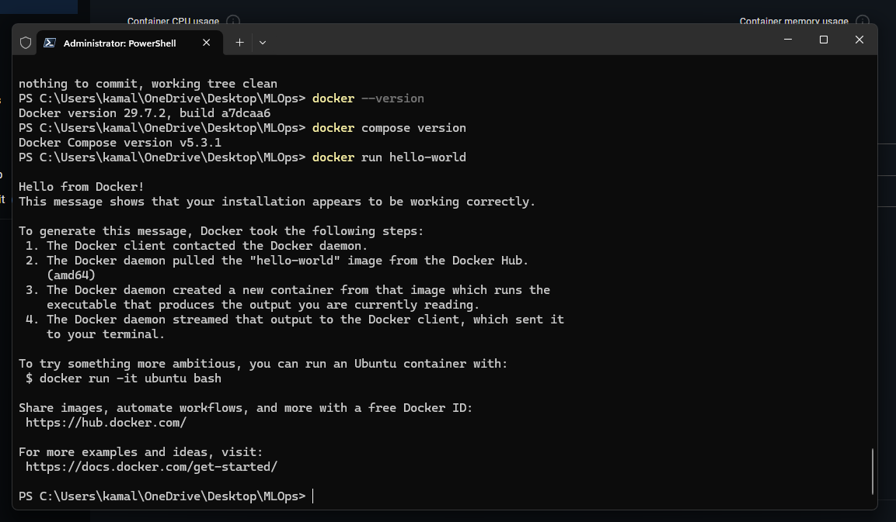

# Ex 5 – Docker Installation and Verification

## Objective

To install Docker Desktop on Windows and verify that the Docker environment is working correctly by running the Docker `hello-world` container.

---

## Software Used

- **Operating System:** Windows 10
- **Docker Desktop:** 4.86.0
- **Docker Engine:** 29.7.2
- **Docker Compose:** 5.3.1

---

## 1. Docker Desktop Installation

Docker Desktop was installed on the Windows system using the recommended **Per-user installation** option.

After installation, Docker Desktop was launched successfully and the Docker Engine was started.

---

## 2. Verify Docker Installation

The Docker version was checked using the following command:

```powershell
docker --version
```

### Output

```text
Docker version 29.7.2, build a7dcaa6
```

This confirms that Docker is installed and available from the command line.

---

## 3. Verify Docker Compose

The installed Docker Compose version was checked using:

```powershell
docker compose version
```

### Output

```text
Docker Compose version v5.3.1
```

This confirms that Docker Compose is also installed and available.

---

## 4. Run Docker Hello World Container

The Docker installation was tested by running the official `hello-world` image:

```powershell
docker run hello-world
```

Docker successfully downloaded the `hello-world` image from Docker Hub, created a container, executed it, and displayed the verification message.

### Output

```text
Hello from Docker!

This message shows that your installation appears to be working correctly.
```

The output also confirms that:

1. The Docker client successfully contacted the Docker daemon.
2. The Docker daemon successfully pulled the `hello-world` image from Docker Hub.
3. Docker successfully created a container from the image.
4. The container executed successfully.
5. The output was returned to the terminal.

---

## 5. Verification Screenshot

The following screenshot provides evidence of the successful Docker installation and execution of the `hello-world` container.



---

## 6. Result

Docker Desktop was successfully installed and configured on Windows.

The installation was verified using the following commands:

```powershell
docker --version
docker compose version
docker run hello-world
```

The `hello-world` container executed successfully, confirming that the Docker environment is working correctly.

---

## Conclusion

The Docker environment required for container-based development and MLOps workflows was successfully installed and verified.